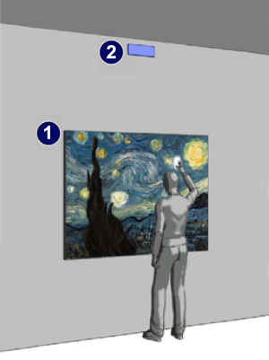
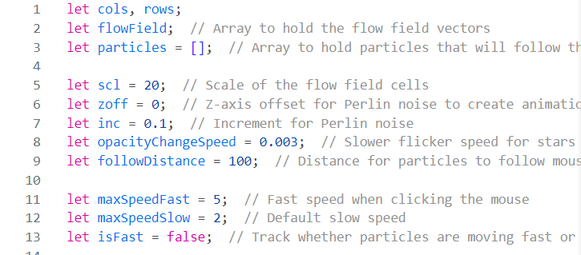
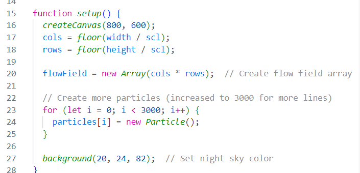
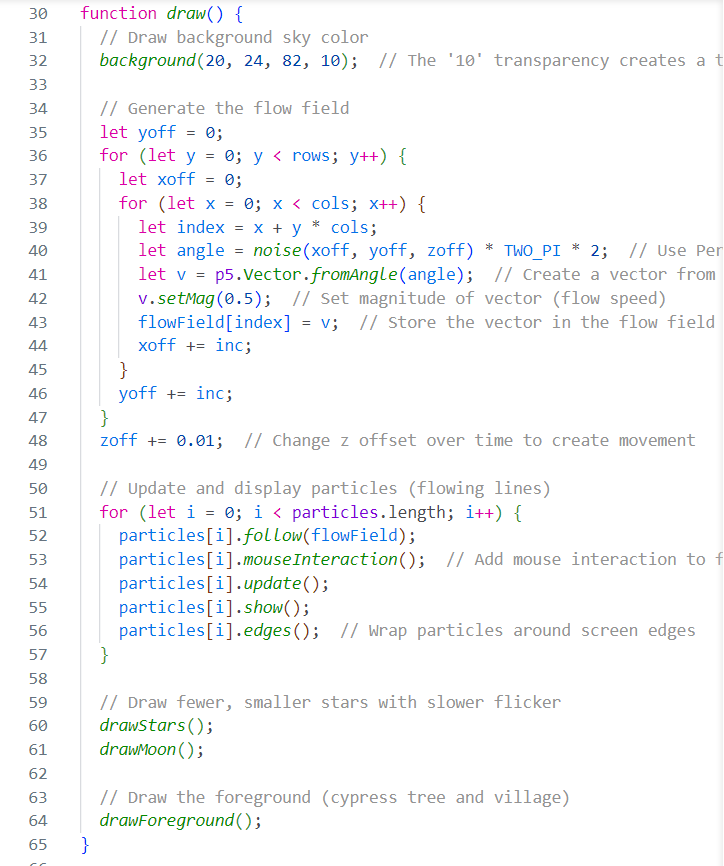
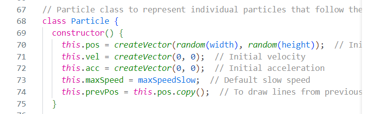
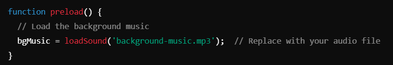
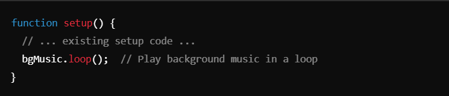
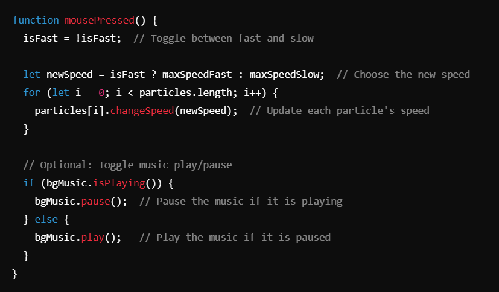

# Quiz-8
#### **Part 1: Imaging Technique Inspiration**
##### Inspired by Starry Night, this work deconstructs Van Gogh's painting and recreates it using digital algorithms, incorporating interactive elements. The aim is to rediscover classical art and use it for educational purposes. Moreover, the technologies contribute to the project's completion: animation design, dynamic interaction, customizable speed, and responsive sound design. Classical art serves as the artistic foundation for the project, while dynamic interaction allows users to engage with the artwork through mouse movements. Customizable speed introduces randomness to the animation, and responsive sound design ensures synchronization between the audio and the animation.

[Link Video](http://artof01.com/starryNight.html)
> Vrellis, *Starry Night.* Accessed September 26, 2024. http://artof01.com/vrellis/works/starry_night.html.
#### **Part 2: Coding Technique Exploration**
This sentence is about the `array`.

##### Create arrays that determine canvas size, animation speed, 3D effect, and mouse influence radius.
This sentence is about the `setup()` function.

##### Create the setup () function, initialize the array, and create the particles.
This sentence is about the `draw()` function.

##### Create the draw () function to draw backgrounds and elements and increase transparency, create a trail effect when moving particles, and let particles move with the mouse.
This sentence is about the `class of particles`.

##### Create a class of particles, constructors to limit line position and speed.
This sentence is about the `Audio array`.

This sentence is about the `loadSound ()` function.

##### Load the audio through the loadSound () function.
This sentence is about the `setup()` function.

##### Start the loop of background music in setup () using the bgMusic.loop () method.
This sentence is about the `mousePressed()` function.

##### Control the playing and pausing of music with modifications to the mousePressed () function.
> OpenAI, *ChatGPT Iteration.* Accessed September 26, 2024. https://chatgpt.com/c/66f54b1a-2b9c-8001-b47d-06d2ef3fd4ad.